# Kanbani Web Viewer

Kanbani Web Viewer (KWV) is a Trello-like browser for sync files produced by [Kanbani](https://pdapps.org/kanbani) - a free task manager for Android.

**This is only a viewer, it does not have editing capabilities!** (yet? ;)

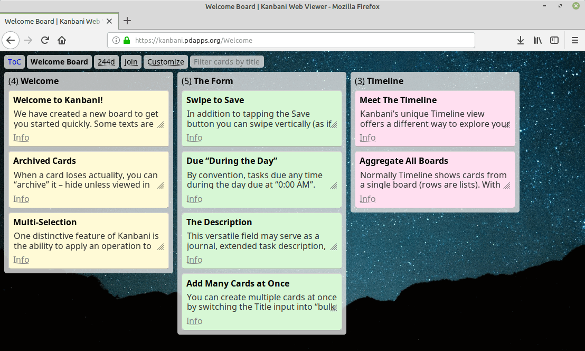
(see [online demo board](https://kanbani.pdapps.org/Welcome))

Note: if you need to parse or pack the data in Kanbani format use [this PHP package](https://github.com/PDApps/KanbaniDataPHP).

## Why use it?

- It works on iOS, Windows, Linux and any other platform with a web browser, even with a JavaScript-less one
- It lets big boards benefit from large screens, with vertical layout and proper print view
- It supports [plugins](plugins/) written in PHP and JavaScript
- It has functions to export and import data in various formats (CSV, Trello, etc.)
- And, just like Kanbani, it is totally (money-)free, ad-free and tracker-free!

## How to use it?

If you are syncing to the default Kanbani profile then simply open its Share screen on your device and switch to the `Online Viewer` tab. There, either scan the QR code or copy or email yourself the URL.

## How to install it?

If you have your own sync server then you can use KWV to browse Kanbani boards synced using WebDAV or any other transport to that server:

1. Download [latest release archive](https://github.com/PDApps/KanbaniWebViewer/releases) and extract it into the `public_html` directory of your web server or to a subdirectory (so you get `.../public_html/index.php` or `.../public_html/kwv/index.php`).
2. Open your website's page in your browser that is hosting KWV (`http://my.site/kwv/`) to finish the setup using KWV's install wizard.
3. Enjoy!

Upgrading:

1. Download and extract the latest release archive, overwriting any existing files.
2. Enjoy!

You can set up KWV manually without using the [install wizard plugin](plugins/install.php):

1. Create and edit the config file (`config.php`). See `config-defaults.php` for available options. At minimum, specify the location of your Kanbani files under `unserialize.path`, else you will only be able to browse the [bundled](plugins/welcome.php) Welcome Board:
```PHP
<?php
return [
    "unserialize.path" => "/home/kanbani/ftp",
];
```
2. For better performance, ensure that the `cache` directory exists in KWV's directory (`public_html`) and that it is writable.

## What it needs?

- PHP 7 or above
- The `gd` PHP module, if generating QR codes using the included [phpqrcode](https://github.com/t0k4rt/phpqrcode) [plugin](plugins/phpqrcode.php)
- The `openssl` PHP module, if dealing with encrypted boards

## And yet, why not just use Trello, JIRA, Asana, Todoist, other\_task\_manager?

Ah, I love this question. Let us drill into details!

### Vertical view mode and printing styles

Trello is poor when it comes to big boards (hundreds of cards, let alone thousands) - it limits you to a narrow column with only title, and forces you to go one card after another to review them en masse.

Not so with KWV - you can switch to a layout where cards occupy all available screen width and show full descriptions (not just excerpts).

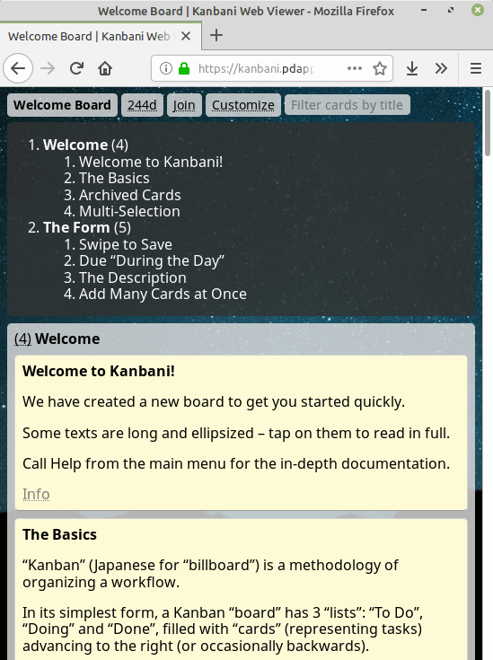
(see [online demo](https://kanbani.pdapps.org/Welcome?view=vert))

Even better, built in Table of Contents allows quick navigation between hundreds of cards in some dozen lists without changing your context.

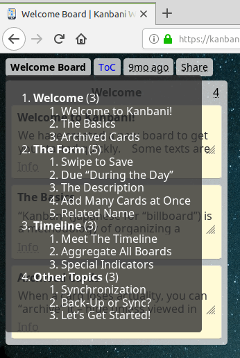
(see [online demo](https://kanbani.pdapps.org/Welcome#toc))

KWV also has much more sane printing view, both for horizontal and vertical layouts where the latter looks just like a book - great for somebody who is getting started with an existing board and needs to ingest it in the entirety.

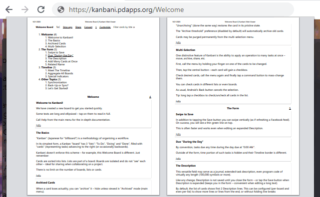

Plus, there is 1-click plugin for importing Trello boards to enhance Trello "within" KWV just when you need it.

### Rich filters and customization

Filter cards by title, description, related name (author), archived flag, or sort them by any field, or change card color display mode, display description snippets, set board's background and layout, etc. etc. Like in mobile Kanbani, KWV allows most of these applied on the per-list basis.

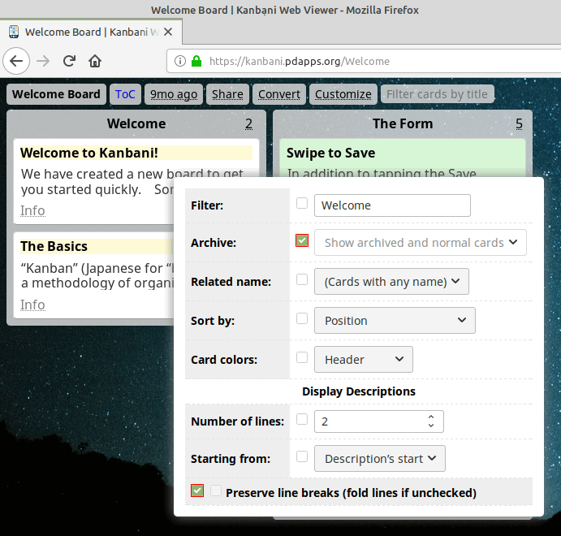
(see [online demo](https://kanbani.pdapps.org/Welcome?0~_filter=1&0~filter=Welcome&0~cardColors=fg&0~_cardColors=1&p=5f808c73-2907-48a04-a4f-000000000011))

Board's view state is stored in the URL so, as the link above demonstrates, you can bookmark it to preserve your settings (because… see the next point).

### No registration

KWV works by sharing URLs. Install Kanbani and sync a profile to KWV - this gives you a long random "profile ID" acting as a username that any number of people can use to access synced boards. No emails, no passwords†, no database, no tracking (see the next point).

† Not entirely true: if you encrypt the profile then visitors will have to supply the same Secret. Reminds you of file sharing, eh?

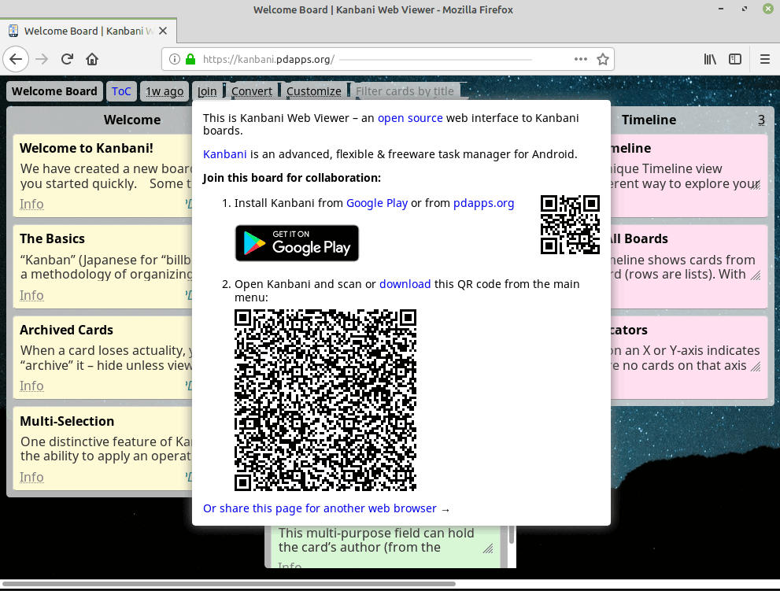

### Security and privacy

Hardly any task manager, and certainly none of the cloud-based services let you retain full control (or any control!) over your data. With Kanbani, you can combine 1-tap encryption† (that hides your data) with your own sync server (that hides the fact you are using it) and not depend on any 3rd party at all, ever.

† Its solidity testified by the [source code](https://github.com/PDApps/KanbaniDataPHP/blob/master/sync.php#L75).

### Hassle-free import and export

Trello generously lets you export data to JSON, but CSV export requires Business Class and you are out of luck for import options at all. KWV lets you export to JSON, CSV, VCS and plain text and import those plus Trello's JSON out of the box. And if you are a programmer in need, it is trivial to roll your own [converter](plugins/import.php).

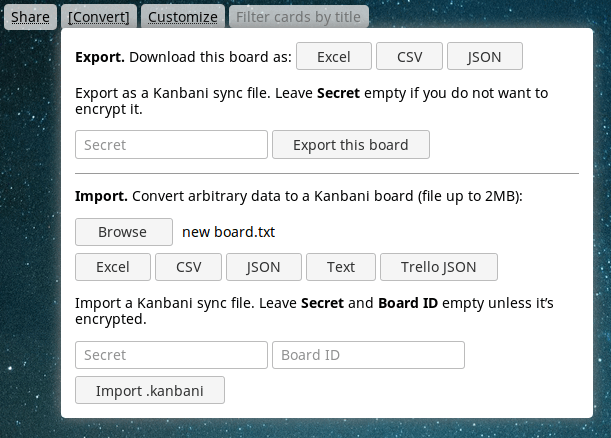

### Built-in chat

Though very simple for now, it lets visitors viewing the same profile exchange text messages. This is also useful for storing quick notes between sessions since messages persist for a few days.

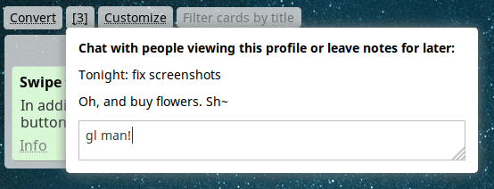

### No JavaScript (mostly)

JavaScript in KWV is added on top of the page, not instead of it. This makes for more responsive experience since browser doesn't execute ton of scripts in background, plays better with offline viewing, on-page search, various addons and is better for ecology.

## Tidbit: plain text import format

This is the simplest way to create a board from scratch. The format matches mobile Kanbani's text Sharing as goes like this:

```
List title

Card title
Related name
D-U-E T:M ZONE

Description
more description lines...

---

Card title...
<...as above>

===

List title...
<...as above>
```

All components except List and Card titles are optional. Blank line before Description is required if the latter is present.

Example:

```
First List

First card's title
authored by me
2020-09-22 13:45 EST

Lorem lorem
ipsum ipsum...
---

This is another card - no related name, no due, no description
===
List number two
First card in there
myself
```


# Developer's corner

KWV is not using any framework and so is very easy to get started with. Fundamentally, it is built around event hooks to allow extraordinary customization - you can override any behavior, disable any element, add a new page, plug an import/export converter and so on.

The best way is to learn by example - most [plugins](plugins/) are short and easy to follow, [check](plugins/abuse.php) [them](plugins/background.js) [out](plugins/toc.php).

## Hooks and context

There are dozens of events triggered in various situations. For example, when user visits a page, the event called `serve_<?do value>` takes place. This way, `...kwv/index.php?do=viewBoard` triggers `serve_viewBoard`.

Triggering an event means invoking all of its listeners one after another until the first that returns a non-`null` value.

Imagine we want to add a new text page with our Terms of Service, which opens at this URL: `index.php?do=tos`. First, we add a new PHP plugin file, e.g. `plugins/my-tos.php`:

```PHP
<?php
$context->hooks->register("serve_tos", function () {
    ob_start();
?>

<article class="tos">
    <h1><?=$this("Terms of Service")?></h1>
    <p>Lorem ipsum dolor...</p>
</article>

<?php
    echo $this->hooks->template("empty", [
        "bodyAttributes" => ["class" => "body_shaded"],
        "body" => ob_get_clean(),
    ]);
    return true;
});
```

- All PHP files in `plugins/` are automatically included as if they were part of `index.php`.
- Included files are given one variable: `$context`, which is a [`Context`](helpers.php#L175) object.
- The `hooks` property of `$context` is a [`Hooks`](helpers.php#L11) object. We use it to add a new event listener that will be invoked whenever users visit a page with `?do=tos`.
- Every listener that is a `Closure` (like in this example) will have its `$this` set to `Context`. This object remains unchanged from request start to end so listeners can use it to pass around any data.
- When serving the `tos` page, we output some HTML. The `$this(...)` construct is a short form of writing `$this->hooks->trigger("translate", ...)` and allows easy localization. If you don't need localization, embed texts directly (like with `Lorem ipsum dolor...` above).
- Finally, we wrap our HTML into the [`empty` template](templates/empty.php), giving it `$vars`: `bodyAttributes` for setting `<body class=...>` to one of standard KWV classes (there are others, read below) and `body` with the actual content.
- `return true` lets the router know that the request was handled, else it would throw up an error.

Save this file and open the new ToS page in your browser. It's a start but the text is hardly readable:

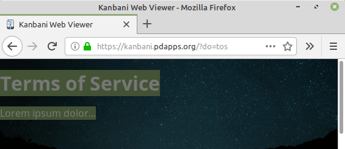

Thankfully, this is easy to fix. Finish by writing `plugins/my-tos.css`:

```CSS
.tos {
    background-color: #fff6;
    margin: 1em;
    padding: .1em 1em;
    position: relative;   /* overlays .body-shaded's shader */
}
```

- CSS and JS files in `plugins/` are added into the `empty` template automatically. Since all standard pages are using `empty`, it means they are added into every standard page.
- If using the included [`minify.php` plugin](plugins/minify.php), stylesheets and scripts are transparently glued together and compressed.

Ah! Looks better now, doesn't it?

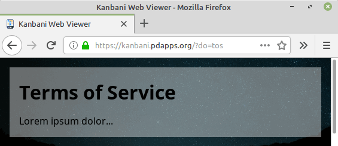

Congratulations on writing your first plugin!

## Useful methods and properties

This section outlines most useful things in the `Kanbani` namespace. Feel free to refer to the [source code](helpers.php) for details.

### Hooks

- `$frame` - object storing data between calls to event listeners of the same event
- `__invoke()` - magic method for quick triggering of the `translate` event by calling `Hooks` as if it was a function: `$hooks("%s seconds", 123)`
- `__call()` - magic method for quick triggering of any event as if it was a PHP method on `Hooks`: `$context->hooks->some_event("arg", ...)`
- `trigger($event, $args = [])` - invokes listeners of `$event`: first (`registerFirst()`), normal (`register()`), last (`registerLast()`) and returns first non-`null` result; before returning, calls after-listeners (`registerAfter()`) giving them the result to be returned as first member in `$args`
- `register($event, $func)`, `registerFirst()`, `registerLast()`, `registerAfter()` - register a new event listener (hook)
- `template($name, $vars = [])` - triggers `echo_$name` and returns `echo`ed output as a string

### Context

These properties are always available:

- `$hooks` - `Hooks` object
- `$config` - array of config values merged from `config.php` and `config-defaults.php`
- `$custom` - object storing custom data, for use by plugins (do not create new properties directly on `Conext` to avoid conflicts with future versions)
- `$tz` - current timezone (matches `date_default_timezone_get()`)
- `$locale` - current locale (matches `setlocale(0)`)
- `$language` - language tag string (e.g. `de_DE`), for use in HTML `lang` attribute and `Accept-Language` header
- `$request` - array of request variables (`$_REQUEST`, in default PHP configuration this is `$_GET` plus `$_POST`)
- `$server` - copy of `$_SERVER`
- `$files` - array of uploaded files (`$_FILES`), omitting failed uploads (with non-0 `error`)
- `unserialize()` - trigger `unserialize` if the context is missing profile data

These properties are available in certain contexts:

- `$syncFile`, `$syncData` - [SyncFile and SyncData](https://github.com/PDApps/KanbaniDataPHP/blob/master/sync.php) objects, when serving board-related pages
- `$currentBoard` - object with Kanbani board data, one of `$syncData->boards` members
- `$profileID` - string given as `?profile` for identifying the same set of boards; if `null` then current page was generated on the fly and cannot be accessed again (or it is not board-related)
- `$kanbaniQrCode` - [QrCodeData](https://github.com/PDApps/KanbaniDataPHP/blob/master/qrcode.php) object for encoding as a Kanbani shared profile QR code; if `null` then current board (profile) cannot be accessed by the app; if not `null` then `$profileID` is also not `null` and indicates a valid Kanbani sync profile ID

Useful methods:

- `__invoke()` - magic method for quick triggering of the `translate` event by calling `Context` as if it was a function: `$context("%s seconds", 123)`
- `syncData($data = null, $file = null)` - indicates that this context (page) is board-related; if any argument is `null` then new a `SyncData`/`SyncFile` is created; `$currentBoard` is set to the first `$data->boards` (which must not be empty)
- `currentBoard($board)` - checks that `$board` is one of `$syncData->boards` and sets `$currentBoard`
- `persistentReadOnly($profileID)`, `persistent($profileID, $qrCode)` - set `$profileID` and `$kanbaniQrCode` (for board-related context only)

### Global

Like all classes, these are also under the `Kanbani` namespace.

- `JSON_FLAGS` - constant expanding to `JSON_UNESCAPED_SLASHES | JSON_UNESCAPED_UNICODE`, making `json_encode()` produce much shorter output
- `PublicException` - class extending `Exception` that indicates an error that is safe to disclose to the user (i.e. without sensitive details)
- `htmlOptions($values, $titles, $current = null)` - returns a string of `<option>` tags
- `htmlAttributes($attrs)` - returns a space-separated string of HTML `key="value"` pairs
- `timeInterval($to, $now = time())` - returns an array in `translate` format that indicates the distance between `$now` and `$to`, such as "in 2d" (2 days into the future)
- `formatTime($time)` - returns an array in `translate` format with `$time` presented as a locale-specific date or date+time string, plus `timeInterval()`, such as "1:31 AM 1/2/2021 (in 3mo)"
- `formatNumber($number, $decimals = 0)` - like standard `number_format()` but returns a locale-specific string, such as `1,234.56`

## Event reference

- `start` - the first event to occur, triggered after loading all PHP `plugins/` to fill `Context` with basic data about the request (such as `$locale`)
- `echo_$template ($vars)` - `echo`es a formatted template; `$hooks->template()` returns it as a string
    * `template/$template.php` is automatically loaded (if exists) similarly to plugins, but `template/*.css|js` are not handled specially
- `serve_$task` - handles current request; if no hooks returned `true`, `index.php` outputs a 404 error page
- `translate ($format, ...$args)` - returns a string; arguments are `sprintf()` style; [example](plugins/localize.php)
    * attention: even without `$args`, `%` symbols in `$format` must be doubled for escaping: `translate("100%")` will fail, `translate("100%%")` is correct
- `external ($url)` - returns an URL used in `<a href=...>` when `$url` points to an external resource; [example](plugins/unrefer.php) that rewrites links via an intermediate page to conceal potentially sensitive referrer information
- `format ($text, $source = null)` - returns HTML representation of `$text`; [default implementation](plugins/defaults.php) only adds line breaks and highlights links; when formatting a card's description, `$source` is an object
- `unserialize` - request to fill `Context` with Kanbani data (call `syncData()` and others), such as during `serve_viewBoard` (return `true` if handled); by convention, profile ID is held in `?profile` query parameter; [example](plugins/welcome.php), [another](plugins/unserialize.php)
- `decrypt (array $options)` - request to `unserialize` an encrypted profile (return `SyncData` on success); `$options` members: `filePath`, `syncFile` (optional `SyncFile` that is filled with `filePath`'s data on success), `profileID` (optional)
- `updated` - returns `true` if `Context`'s profile was updated since last `unserialize` (caller earlier within the same request)
- `canonical ($query)` - returns a fully qualified URL to this KWV installation, with given parameters; `$query` may be a string (`a=b&c=d`) or an array (`["a" => "b", "c" => "d"]`); [default implementation](plugins/defaults.php) tries to guess current server set-up
- `filter (array &$cards)` - remove cards not matching current request's filters, sort them, etc.; [example](plugins/customize.php)

Generally, events occur in this order:

```
user requests index.php?do=viewBoard
  -> plugins/*.php loaded
    -> "start" triggered
      -> "serve_$do" (serve_viewBoard) triggered
        -> "unserialize" triggered
          -> "decrypt" triggered
              -> "filter" triggered
                -> "echo_$template" (echo_board) triggered
                  -> "templates/$template.php" (templates/board.php) loaded
                    -> "translate" triggered
```

## Standard pages

These are known `serve_$task` events:

- `viewBoard` - view a Kanbani board
- `viewCard` - view an individual card; visitors usually access this indirectly via AJAX after clicking on a card's title rather than opening a separate page
- `decrypt` - access encrypted Kanbani profile; see [`decrypt` plugin](plugins/decrypt.php)
- `export` - download Kanbani data (boards, cards or other) in different format, e.g. CSV
- `import` - turn a file into Kanbani board(s); the inverse of `export`
- `qrImageProfile` - generate QR code for Kanbani profile sharing (see [SyncData](https://github.com/PDApps/KanbaniDataPHP/blob/master/sync.php))
- `qrImageWeb` - generate QR code for opening this KWV installation (encodes an URL)
- `install` - used by the [installer plugin](plugins/install.php)
- `chat` - used by the [simple chat plugin](plugins/chat.php)

## Template reference

There are multiple `echo_$template` events that you can override to customize the interface. For example, to add a label to all cards that have "IMPORTANT" string in their description create this plugin:

**plugins/my-important.php:**

```PHP
<?php
$context->hooks->register("echo_cardItem", function (array $vars) {
    if (strpos($vars["card"]->description, "IMPORTANT") !== false) {
?>
<mark class="isle important">
    <?=$this("Important!")?>
</mark>
<?php
    }
});
```

**plugins/my-important.css:**

```CSS
.important {
    background-color: #faa;
}
```

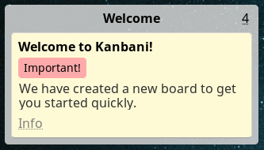

### Main templates

- `empty` - HTML page with only stylesheets and scripts from `plugins/`; variables: `$body` (`<body>` content), `$bodyAttributes` (array for `<body ...>`), `$css`/`$js` (arrays of URLs), `$title` (for `<title>`)
- `exception` - used by [`plugins/exception.php`](plugins/exception.php) when displaying an uncaught exception page; variable: `$exception`
- `board` - `viewBoard` page; variable: `$filters`
- `card` - `viewCard` page; variables: `$card`, `$list`
- `qrCode` - QR code image (can be binary); variables: `&$headers` (array, at minimum must include `Content-Type: ...`), `$large` (boolean indicating desired target size), `$data` (string to be encoded), `$kanbaniQrCode` (`QrCodeData`, or `null` if not encoding a profile QR code); [example](plugins/phpqrcode.php)
- `decrypt` - a piece of info or a form with controls for providing data for viewing an encrypted profile; may be embedded into another page
- `decryptPage` - complete HTML page wrapping the `decrypt` template, to be output instead of the requested content when user has to unlock it

### Templates used by `board`

Layout of the `viewBoard` page, top down:

```
+-------------------------------------------+
|  Page header,  single line (boardHeader)  |
+-------------------------------------------+
· Additional invisible content  (boardBars) ·
+-------------------------------------------+
|   The board area,  i.e. lists and cards   |
|  __________ _____________ __________      |
| |___List___| __listItem__| ___...___|    >|
| | Card     | cardItem    |          |    >|
| | Card     | cardItem    |          |    >|
|_|_...______|_..._________|__________|____>|
```

- `boardHeader` - content of the header, with info buttons and search input
- `boardShare` - content of the "Join"/"Share" info button in the header
- `boardExport`, `boardImport` - controls for picking formats in the "Convert" info button; variable: `$form` (`id` of the associated `<form>`)
- `boardCustomize` - table rows for board filters in the header and list filters in `listItemInfo`
- `boardBars` - content between the header and the board area ([ToC](plugins/toc.php) is normally placed here); in horizontal mode (aka "Trello"), having anything visible in this area will add vertical scrollbar to the page
- `listItem` - the column representing a board list; variables: `$list`, `$attributes` (given by reference, represents the parent node's attributes), `$cards` (array in `Context`'s `$cards` format)
- `afterListItem` - content after `listItem` (not necessary between two lists); variable: `$list`
- `listItemInfo` - content of the hint, including per-list filters, on top of each list; variable: `$list`
- `cardItem` - content of the box representing a card in the list; variables: `$card`, `$attributes`
- `afterListItem` - content after `cardItem`; variable: `$card`
- `cardItemInfo` - content of the "Info" hint near each card in the list; variable: `$card`

### Templates used by `card`

The `viewCard` page is split into two columns: card's description (left) and ancillary info (right).

- `cardInfo` - content of the right-side column; variable: `$card`
- `cardExport` - "Download" links in the right-side column; variable: `$card`

## CSS reference

KWV CSS class names follow [BEM notation](https://bem.info) - "Block" `__` "Element" `_` "Modifier", with words in individual components separated by `-`: `info-hint__block-img_max-height` (`info-hint` block, `block-img` element, `max-height` modifier).

Blocks are isolated components on a page. Elements cannot be located outside of their root block. Element part is missing for block's root node (`info-hint`). Modifier is optional (`info-hint__title`). `info-hint_relative` has no element but has a modifier.

KWV does not use Bootstrap or any similar framework, it only uses [normalize.css](https://github.com/necolas/normalize.css). Below are classes useful in your plugins, see [kwv.css](kwv.css) for details:

- `body.body_shaded` - small content area visually overlays page background (example: card view when opened outside of a board)
- `body.body-overlay` - similar but overlays a page with its own content (example: card view on top of the board)
- `body.body_full` - assumes `height: 100%` (example: board page)
- `body.js_no`, `body.js_yes` - indicate if JavaScript is on or off (you can check for them but don't add them)
- `.middle` - creates a vertically and horizontally centered container (example: [exception page](plugins/exception.php)); mostly useful on `body` with `.body_full`
- `.light-shade` - fakes a small shadow below the element using its border (example: card box in the card list)
- `textarea.block-area` - an edit box filling entire line
- `.isle` - adds semitransparent background below (example: info buttons in board's page header)
- `.filtered` - hides the node (example: list cards that do not match filter criteria)
- `.round` - adds `border-radius` with standard value (example: card view on top of the board)
- `.switch` - groups separate content so that only one is seen at a time (example: [board sharing](templates/boardShare.php) info button)
- `table.tbl` - generic table
- `.info-hint` - attaches floating content visible when hovering over the small `.info-hint__title` element (example: info buttons in board's page header)
